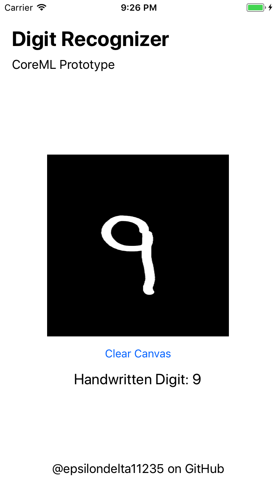

# iOS-Digit-Recognizer

iOS digit handwriting classifier. Leverages Apple CoreML and Vision frameworks introduced at WWDC17. Using MNIST dataset, a Convolutional Neural Network was built and trained in Keras. Apple's CoreMLTools was used to convert to a CoreML Model to interface with the frameworks.

